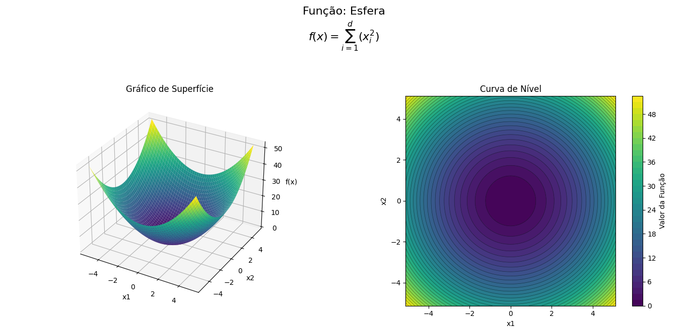
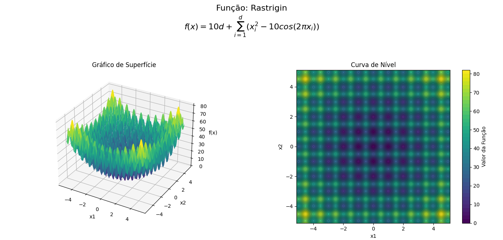
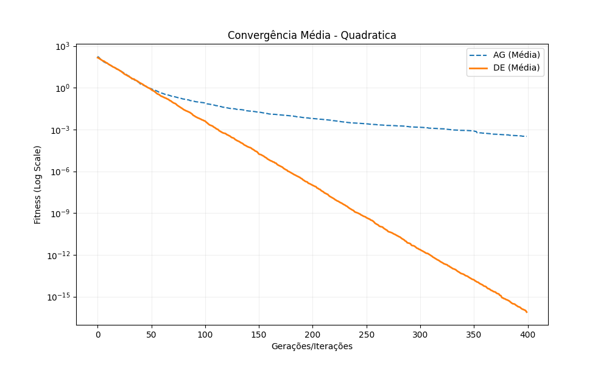
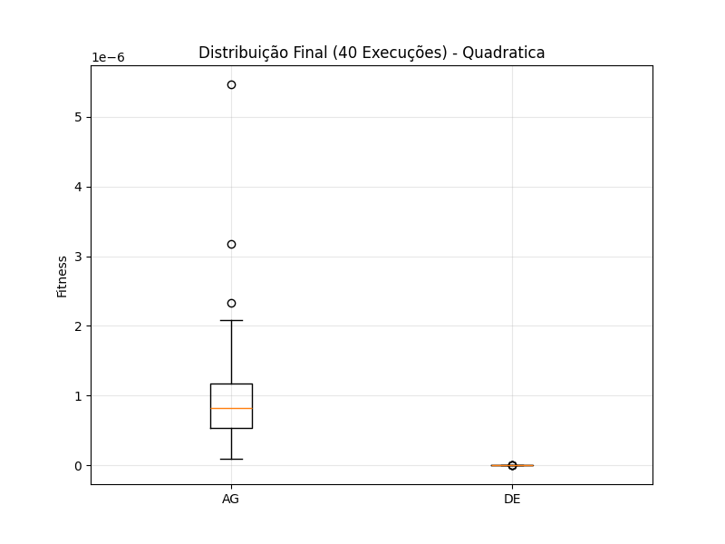

# Projeto-Computacao-Evolucionaria-Python

Trabalho final das matérias de Computação Evolucionária e Python. Une os conceitos das duas matérias, implementando algoritmos genéticos e evolução diferencial em Python. Aplicado na função esfera e na função rastrigin, gerando gráficos estatísticos e relatórios automáticos.

---

# Otimização Evolucionária: Comparativo AG vs DE


Este projeto implementa e compara duas meta-heurísticas de otimização global — **Algoritmos Genéticos (AG)** e **Evolução Diferencial (DE)** — aplicadas a funções matemáticas complexas com e sem restrições.

Desenvolvido como requisito avaliativo para as disciplinas de **Linguagem de Programação (Python)** e **Computação Evolucionária**.

---

## 📑 Índice

1. [Sobre o Projeto](#-sobre-o-projeto)
2. [Funções Objetivo (O Problema)](#-funções-objetivo-o-problema)
3. [Estrutura e Lógica (Sob o Capô)](#-estrutura-de-dados-e-lógica-sob-o-capô)
4. [Resultados Obtidos e Análise](#-resultados-obtidos-e-análise)
5. [Tecnologias Utilizadas](#%EF%B8%8F-tecnologias-utilizadas)
6. [Estrutura de Arquivos](#-estrutura-de-arquivos)
7. [Como Executar](#-como-executar)
8. [Configuração](#%EF%B8%8F-configuração-configtxt)
9. [Licença](#-licença)
10. [Autor](#-autor)

---

## 📋 Sobre o Projeto

O software foi construído utilizando uma arquitetura modular baseada em Orientação a Objetos (POO), separando a lógica matemática do fluxo de controle e da configuração. O sistema realiza múltiplas execuções independentes para garantir robustez estatística e gera relatórios automáticos de desempenho.

### Funcionalidades Principais
* **Configuração via Arquivo de Texto:** Todos os parâmetros (tamanho da população, taxas de mutação, etc.) são lidos dinamicamente de um arquivo externo (`config.txt`), sem necessidade de alterar o código-fonte.
* **Execução Estatística:** Realiza *N* execuções independentes e calcula métricas como Média, Desvio Padrão, Melhor e Pior caso.
* **Visualização de Dados:** Geração automática de gráficos de convergência e boxplots comparativos usando `matplotlib`.
* **Relatórios Automatizados:** Exportação dos resultados consolidados para `relatorio_final.txt`.
* **Tratamento de Erros:** Validação robusta de arquivos de entrada e conversão de tipos.

---

## 🎯 Funções Objetivo (O Problema)

Os algoritmos foram testados em dois cenários distintos de complexidade:

### 1. Função Quadrática (Esfera)
Uma função unimodal clássica, perfeita para testar a capacidade de **convergência e precisão numérica** do algoritmo. É como descer uma tigela lisa até o fundo. O objetivo é chegar em `f(x) = 0`.



### 2. Função Rastrigin Restrita
Uma função multimodal extremamente complexa, cheia de "armadilhas" (mínimos locais). Neste projeto, ela possui restrições severas de igualdade e desigualdade (Penalidade Estática), testando a **robustez** do algoritmo em evitar zonas proibidas.



---

## 🧩 Estrutura de Dados e Lógica (Sob o Capô)

Para entender como traduzimos conceitos biológicos/matemáticos para estruturas de dados em Python:

### 1. A População (Matriz NumPy)
Tanto no AG quanto no DE, a "população" é tratada como uma **Matriz NumPy** de tamanho `(N_POPULACAO, N_VARIAVEIS)`.
* **Linhas:** Representam os Indivíduos (soluções candidatas).
* **Colunas:** Representam os Genes (as variáveis $x_1, x_2, ..., x_n$).
> **Vantagem:** A vetorização do NumPy torna os cálculos de fitness dezenas de vezes mais rápidos que listas comuns.

### 2. O Algoritmo Genético (AG) - "A Evolução Natural"
O AG imita a seleção natural de Darwin com operadores avançados para números reais:
1.  **Torneio (Seleção):** Sorteamos 2 indivíduos; o melhor vira pai.
2.  **Cruzamento SBX (Simulated Binary Crossover):** Mistura os valores dos pais matematicamente baseada em uma distribuição de probabilidade ($\eta=20$), simulando o comportamento binário em variáveis contínuas.
3.  **Mutação Polinomial:** Pequenas perturbações locais para ajuste fino.
4.  **Elitismo:** Os melhores indivíduos são copiados intactos para a próxima geração.

### 3. Evolução Diferencial (DE) - "A Matemática Vetorial"
Utilizamos a variante **DE/best/1/bin**, focada em velocidade:
1.  **O Líder (`best`):** O algoritmo usa o **Melhor Indivíduo** da geração como base.
2.  **O Salto (Diferença):** Calcula a diferença vetorial entre dois outros indivíduos e soma ao líder: `Novo = Melhor + F * (A - B)`.
3.  **Crossover Binomial:** Substitui componentes do vetor antigo pelo novo com probabilidade $CR$.
4.  **Seleção Gulosa:** O filho só substitui o pai se for estritamente melhor.

---

## 📈 Resultados Obtidos e Análise

Abaixo estão os gráficos gerados automaticamente pelo sistema durante as simulações.

### Cenário 1: Função Quadrática

| Gráfico de Convergência | Distribuição (Boxplot) |
|:---:|:---:|
|  |  |

**Análise:**
Na função Quadrática (unimodal), a estratégia **DE/best** mostrou-se superior. Como não há mínimos locais para "enganar" o algoritmo, seguir o melhor indivíduo permitiu uma descida direta e agressiva em direção ao ótimo global, alcançando precisão próxima de zero absoluto ($10^{-15}$). O AG também convergiu com sucesso, mas com uma velocidade logarítmica menor.

### Cenário 2: Função Rastrigin Restrita

| Gráfico de Convergência | Distribuição (Boxplot) |
|:---:|:---:|
|  |  |

**Análise:**
Neste cenário complexo, houve um *trade-off* interessante:
* **Melhor Solução:** O **DE** encontrou a melhor solução absoluta do experimento (~199), superando o melhor resultado do AG (~884).
* **Estabilidade:** O AG foi muito mais estável. O gráfico de boxplot mostra que o DE possui alta variância (caixa grande e outliers), indicando que, embora capaz de achar o ótimo, ele frequentemente fica preso em regiões de penalidade alta devido à sua natureza "gulosa". O AG, com operadores SBX, manteve-se consistente na busca, embora menos agressivo.

---

## 🛠️ Tecnologias Utilizadas

* **Python 3.x**
* **NumPy:** Computação científica e álgebra linear.
* **Matplotlib:** Plotagem de gráficos e visualização de dados.
* **Módulos Nativos:** `random`, `math`, `os`, `time`.

---

## 📂 Estrutura de Arquivos

```

📁 Projeto\_Otimizacao/
│
├── 📄 main.py           \# Controlador Principal (Entry Point)
│
├── 📄 algoritmos.py     \# Módulo de Lógica (Classes AG e DE)
│
├── 📄 config.txt        \# Arquivo de Configuração (Input)
│
└── 📄 relatorio\_final.txt (Output gerado automaticamente)

````

---

## 🚀 Como Executar

### Pré-requisitos
Certifique-se de ter o Python instalado e as bibliotecas:
```bash
pip install numpy matplotlib
````

### Execução

Para rodar o comparativo, execute o arquivo principal na pasta do projeto:

```bash
python main.py
```

O programa lerá as configurações, executará as otimizações e salvará os resultados (`.txt` e `.png`) na mesma pasta.

-----

## ⚙️ Configuração (`config.txt`)

O comportamento dos algoritmos é customizável via arquivo de texto. Exemplo:

```text
# Configurações Gerais
NUM_EXECUCOES: 40          # Robustez estatística
N_AVALIACOES: 20000        # Critério de parada
N_VARIAVEIS: 10            # Dimensão do problema
FUNCAO_ESCOLHIDA: AMBAS    # QUADRATICA, RASTRIGIN ou AMBAS

# Parâmetros AG (Padrão Acadêmico)
AG_PROB_CRUZAMENTO: 0.9
AG_ETA_CRUZ: 20.0          # Alta explotação

# Parâmetros DE
DE_F: 0.8                  # Tamanho do passo
DE_CR: 0.9                 # Taxa de crossover
```

-----

## 📝 Licença

Este projeto está licenciado sob a Licença MIT.

```text
MIT License

Copyright (c) 2025 Michael Yoshiaki Todoroki

Permission is hereby granted, free of charge, to any person obtaining a copy
of this software and associated documentation files (the "Software"), to deal
in the Software without restriction, including without limitation the rights
to use, copy, modify, merge, publish, distribute, sublicense, and/or sell
copies of the Software, and to permit persons to whom the Software is
furnished to do so, subject to the following conditions:

The above copyright notice and this permission notice shall be included in all
copies or substantial portions of the Software.

THE SOFTWARE IS PROVIDED "AS IS", WITHOUT WARRANTY OF ANY KIND, EXPRESS OR
IMPLIED, INCLUDING BUT NOT LIMITED TO THE WARRANTIES OF MERCHANTABILITY,
FITNESS FOR A PARTICULAR PURPOSE AND NONINFRINGEMENT. IN NO EVENT SHALL THE
AUTHORS OR COPYRIGHT HOLDERS BE LIABLE FOR ANY CLAIM, DAMAGES OR OTHER
LIABILITY, WHETHER IN AN ACTION OF CONTRACT, TORT OR OTHERWISE, ARISING FROM,
OUT OF OR IN CONNECTION WITH THE SOFTWARE OR THE USE OR OTHER DEALINGS IN THE
SOFTWARE.
```

-----

## 🧑‍💻 Autoria

  * **Instituição:** CEFET-MG
  * **Curso:** Engenharia da Computação
  * **Disciplinas:** Programação em Python & Computação Evolucionária
  * **Professores:** Guido Pantuza e André Paganotti
  * **Aluno autor:** Michael Yoshiaki Todoroki
  * **Data:** Novembro/2025

<!-- end list -->

```
```